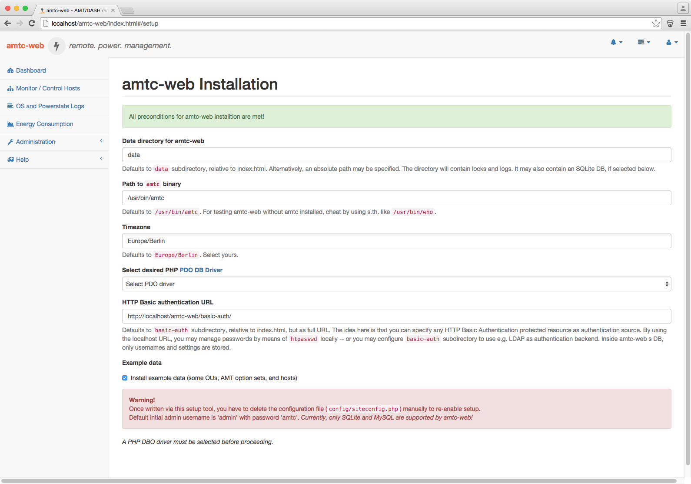
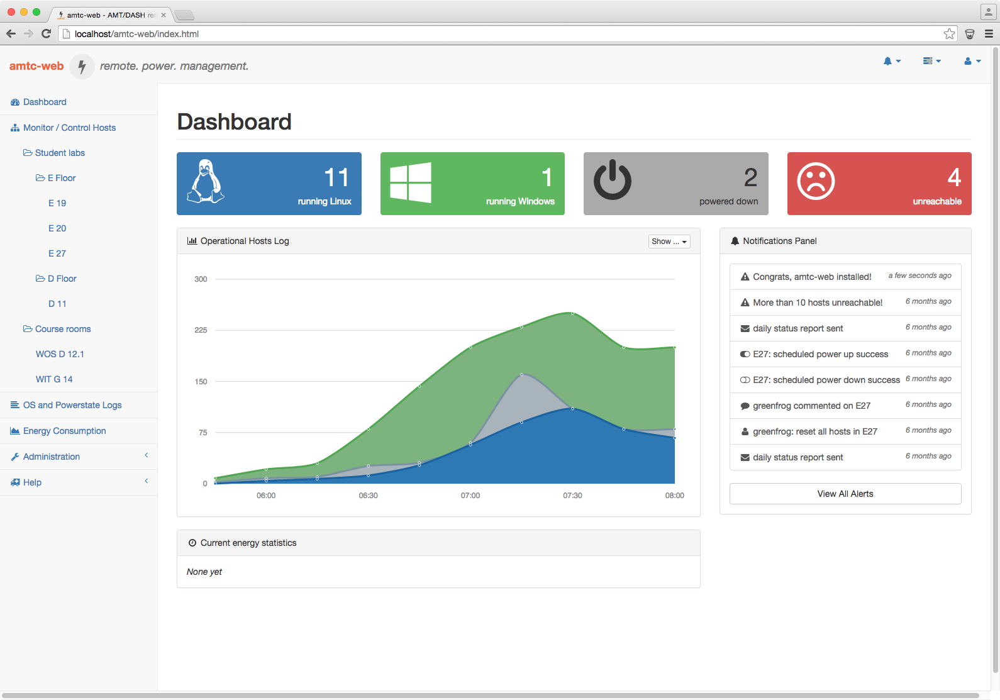
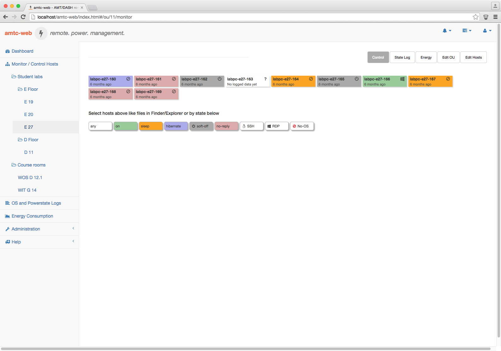
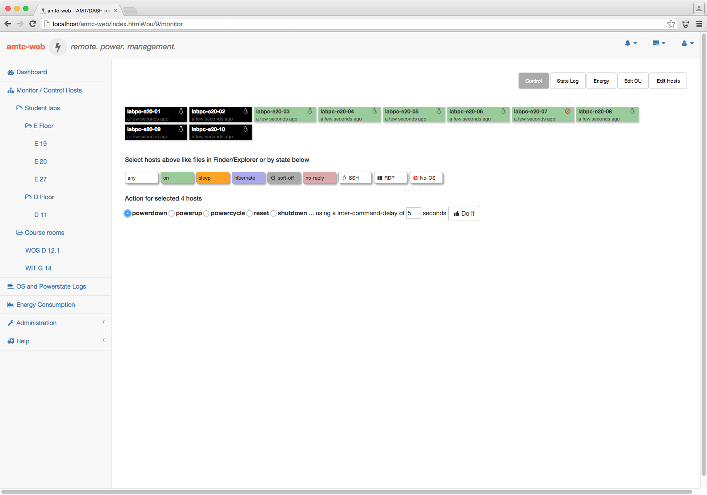
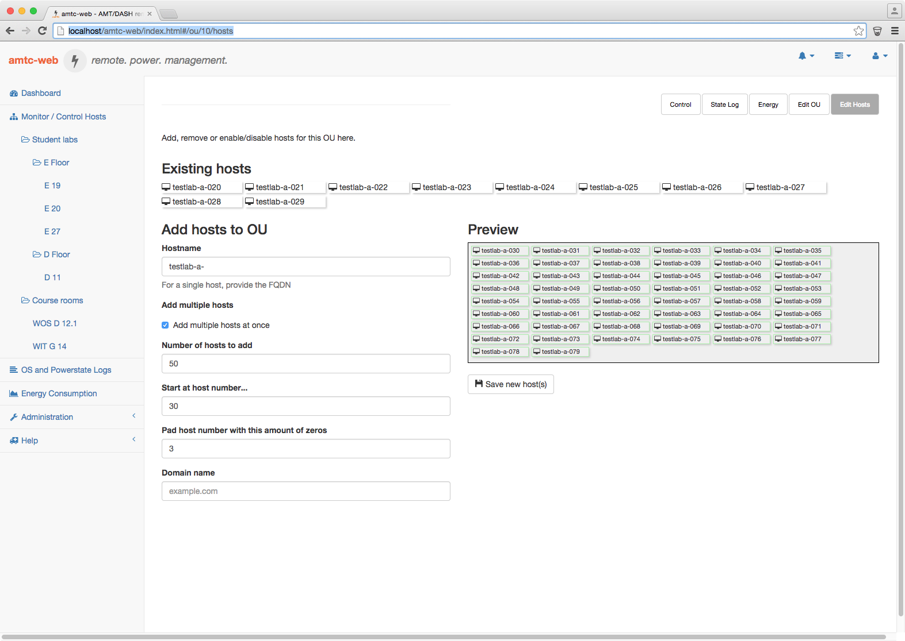
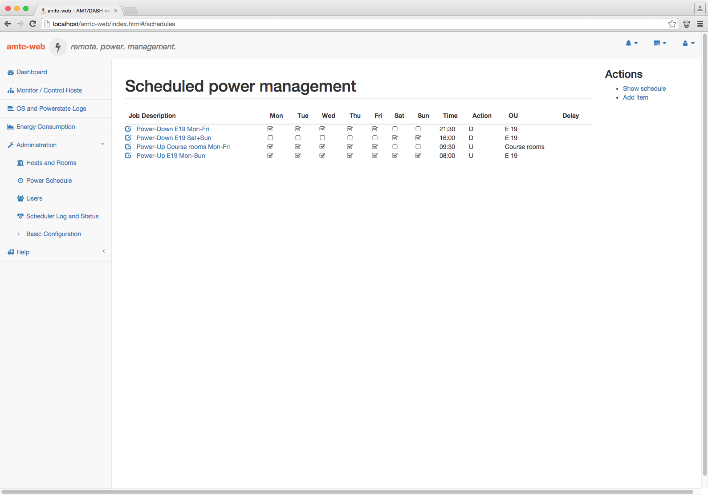

amtc [](https://travis-ci.org/schnoddelbotz/amtc) [](https://insight.sensiolabs.com/projects/e1b66082-35ba-44e5-b460-766bfb918574)
================================

`amtc` - Intel [vPro](http://de.wikipedia.org/wiki/Intel_vPro) [AMT](http://en.wikipedia.org/wiki/Intel_Active_Management_Technology) / [WS-Management](http://en.wikipedia.org/wiki/WS-Management) mass remote power management tool

NOTE!
=====
amtc works fine and there are currently no known issues.
Anyhow -- you may want to look into [amtgo](https://github.com/schnoddelbotz/amtgo), which combines amtc's and amtc-web's functionality in a single, golang-based binary; Apache, PHP and cron no longer needed for amtc-web!

features
========

* performs vital AMT operations (info, powerup, powerdown, reset...)
* threaded, thus fast (queries 180 Core i5 PCs in a quarter of a second (using EOI and no TLS))
* allows mass-powerups/downs/... using a custom delay
* lightweight C application, only depends on libcurl, gnutls and pthreads
* currently builds fine on linux and OSX (and windows via cygwin; unverified since 0.4.0)
* allows quick and comfortable mass-power control via shell and...
* comes with a [EmberJS](http://www.emberjs.com/)-based web interface called `amtc-web`,
  that depends on [Slim](http://www.slimframework.com/) and
  [Idiorm and Paris](http://j4mie.github.io/idiormandparis/) to provide a JSON backend
  for these `amtc-web` features:
  * power state monitoring via AMT© including OS TCP port probing/detection
  * anachronous OOB power control using a database-driven job queue
  * power/OS-monitoring logging with [notyet:] graphing
  * management of master file data like rooms and hosts to control
  * setup (of atmc-web itself, i.e. providing database connection details etc.)
* acts as a tool for flexible and robust scheduled remote power management (which is true for amtc itself and amtc-web; amtc-web just adds another layer of comfort regarding shell interaction with your many hosts).

     

usage
=====

```
 amtc v0.8.5 - Intel AMT & WS-Man OOB mass management tool
                     https://github.com/schnoddelbotz/amtc
 usage
  amtc [-actions] [-options] host [host ...]

 actions
  -I(nfo)     query powerstate via AMT [default]
  -U(p)       powerup given host(s)
  -D(own)     powerdown
  -C(ycle)    powercycle
  -R(eset)    reset
  -X          select PXE as device for next boot (AMT 9.0+)
  -H          select HDD as device for next boot (AMT 9.0+)
  -S(hutdown) using AMT graceful shutdown (AMT 9.0+)
  -(re)B(oot) using AMT graceful reset    (AMT 9.0+)
  -L(ist)  valid wsman <classname>s for -E(numeration)
  -E(numerate)<classname>       enumerate/list settings
  -M(odify)   <setting>=<value> modify wsman settings
              where supported settings: webui,sol or ping
              and supported values    : on or off
 options
  -5          for AMT 5.0 hosts
  -d          for AMT 9.0+ hosts - use WS-Man/DASH
  -m(aximum)  number of parallel workers to use [40]
  -p(asswdfile) specify file containing AMT password
  -j(son)     produces JSON output of host states
  -q(uiet)    only report unsuccessful operations
  -r(DP)-scan probe TCP port 3389 for OS detection
  -s(SH)-scan probe TCP port 22   for OS detection
  -e(nforce)  rdp/ssh probes, regardless of AMT state
  -t(imeout)  in seconds, for amt and tcp scans [5]
  -g(nutls)   will use TLS and port 16993 [notls/16992]
  -c(acert)   specify TLS CA cert file [/etc/amt-ca.crt]
  -n(oVerify) will skip cert verification for TLS
  -v(erbose)  detailed progress, debug by using -vvv
  -w(ait)     in seconds / float, after each pc. one thread.

```

status
======
ever-pre-1.0. just for fun. against all odds. works for me... check the [changelog](CHANGELOG.md).

You may want to [give amtc-web a try](http://jan.hacker.ch/projects/amtc/demo) --
just login with setup default credentials (admin/amtc). The demo page runs off a read-only
sqlite database so you shouldn't be able to make any changes.

`amtc` 0.8.0 introduced the -E option, which serves for retreiving system
configuration and asset management data. Currently, amtc will not parse
those replies and just dump the raw SOAP reply. amtc-web ~~currently~~
offers no way yet to retreive/display those values.

Honestly, in some aspects, `amtc` [still] is a hack. The most obvious
one is: amtc has no clue of SOAP. It dumbly replays control commands
I once wiresharked (see the cmd_* and wsman_* files in src dir).
Other tools available most likely do the right thing™ and use
a real SOAP library like [gSOAP](http://www.cs.fsu.edu/~engelen/soap.html).
If you're hit by this hack, please file a bug of an amtc-run
using -vvvv option -- thanks!

building, installation
======================
See [INSTALL.md](INSTALL.md).

license
=======
This project is published under the [MIT license](LICENSE.txt).
It heavily relies on bundled 3rd party OSS components that are listed in the
in-app ['about' page](amtc-web/pages/about.md) of amtc-web;
their individual license texts have been bundled into
[LICENSES-3rd-party.txt](amtc-web/LICENSES-3rd-party.txt). That file is also
distributed with any [release of amtc](https://github.com/schnoddelbotz/amtc/releases).

alternatives
============
- [amtgo](https://github.com/schnoddelbotz/amtgo) implements functionality of amtc and amtc-web in a single binary. Maybe give it a try first!
- [amttool](http://www.kraxel.org/cgit/amtterm/tree/amttool):
  Without amttool, there would be no amtc. Thanks!
  amttool is implemented in perl and intended for interactive, verbose single-host operation.
  amtc is implemented in C, and by using threads optimized for quick, succinct (non-)interactive mass-operation.
- [amttool_tng](http://sourceforge.net/projects/amttool-tng):
  The next generation. Even more config stuff.
- [vTul](https://github.com/Tulpep/vTul):
  A windows powershell based GUI. Again, completely different story.
- for DASH-only use, the best choice for windows CLI scenarios is most likely AMD's [dashcli](http://developer.amd.com/tools-and-sdks/cpu-development/client-management-tools-for-dmtf-dash/). Find MS SCCM plugins there, too.
- bootstrap your own using the [intel AMT SDK](http://software.intel.com/sites/manageability/AMT_Implementation_and_Reference_Guide)
- [OpenWSMAN](http://openwsman.github.io/): Correct SOAP implementation, rich feature set.
